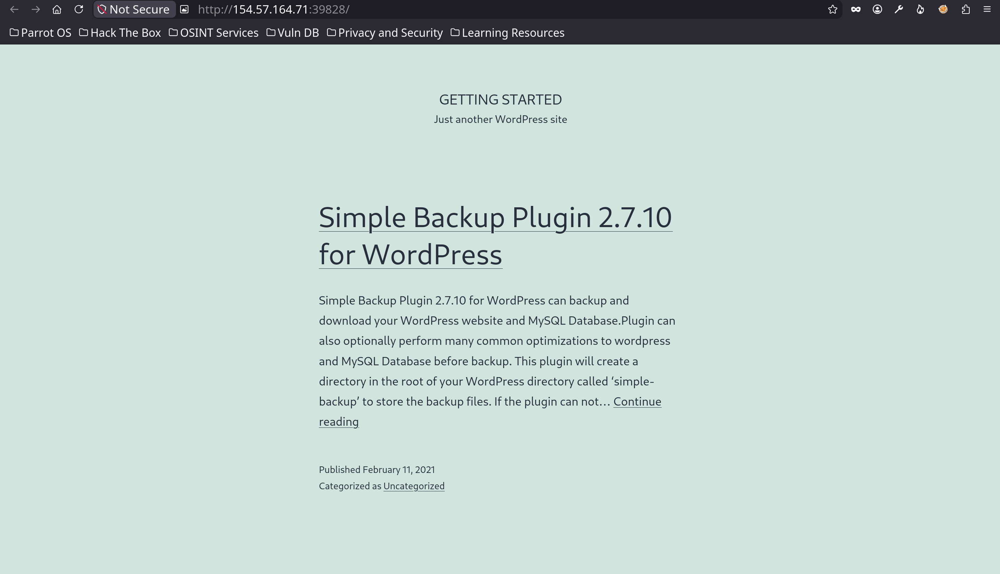
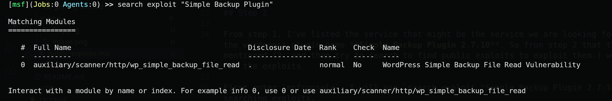
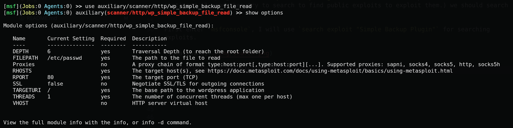
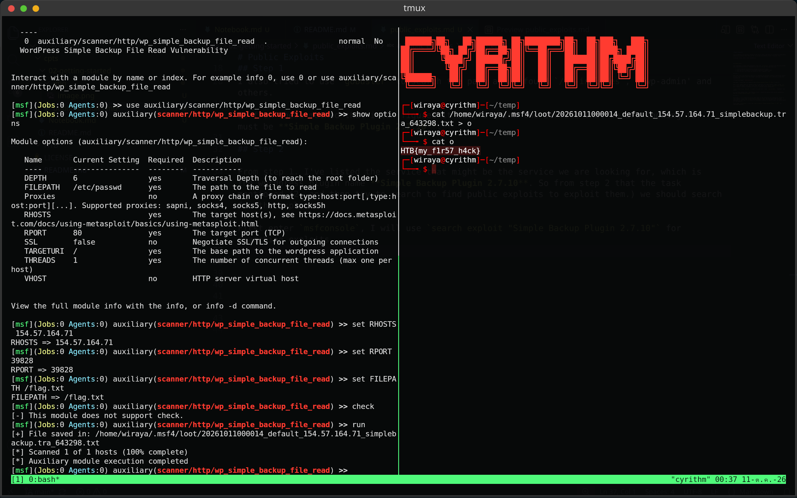

# Public Exploits

Try to identify the services running on the server above, and then try to search for public exploits to exploit them. Once you do, try to get the content of the '/flag.txt' file.

***Target: http://154.57.164.71:39828/***


## **Overview**

This challenge is an introduction to using the metasploit tool like `msfconsole`. Actually, the task has already told us the step-by-step solution. Breaking down the task, we get steps like this.

    1. Try to identify the services running on the server above, 
    2. and then try to search to find public exploits to exploit them. 
    3. Once you do, try to get the content of the '/flag.txt' file.

## Step 1

Okay, let's start with the first step (Try to identify the services running on the server above). In this step, we're going to check the target's web page. Why? Because the `http` protocol is open and welcoming us. 



And boom! I found that this website uses **Simple Backup Plugin 2.7.10**. I note it down.

But I still wanted to check another thing in case this is a fake service. So I tried `curl -I` to get the header info. And I found that this website uses `Server: Apache/2.4.41 (Ubuntu)`, but it isn't useful for identifying if this is the service we are looking for. 

I also tried using `gobuster` to search the paths, and I found `/wp-includes`, `/wp-admin`, and others. 

So from all the methods I used, I think the service we are looking for must be **Simple Backup Plugin 2.7.10**.

## Step 2

From step 1, I've identified the service that might be the one we are looking for, which is the WordPress plugin named **Simple Backup Plugin 2.7.10**. So for step 2, as the task mentioned (2. and then try to search to find public exploits to exploit them), we should search for exploits.

First, I enter `msfconsole`. I will use `search exploit "Simple Backup Plugin"` to search for exploits.



I found only one matching module, which I will use. 

Why? Because when I use `show info`, the description section tells me that:
```
  Description:
  This module exploits a directory traversal vulnerability in WordPress Plugin
  "Simple Backup" version 2.7.10, allowing to read arbitrary files with the
  web server privileges.
```

This line, **"allowing to read arbitrary files with the web server privileges,"** matches our intention, because we want to get `flag.txt`, which is a file on the web server. 

Then I will check the options. 


- Set RHOSTS to **154.57.164.71** by running this command: `set RHOSTS 154.57.164.71`
- Set RPORT to **39828** by running this command: `set RPORT 39828`
- Set FILEPATH to **/flag.txt** by running this command: `set FILEPATH /flag.txt`

Then use the `run` or `exploit` command to exploit it.

Boom, the output shows the saved file path.


## Step 3

Let's read the content inside the file. I use the `cat` command to show the content, but I also redirect it with `>` to a file named `o` inside a familiar path, because the original path is too long.

Then `cat o`, and boom!!!! It contains the flag. 

`HTB{my_f1r57_h4ck}`

